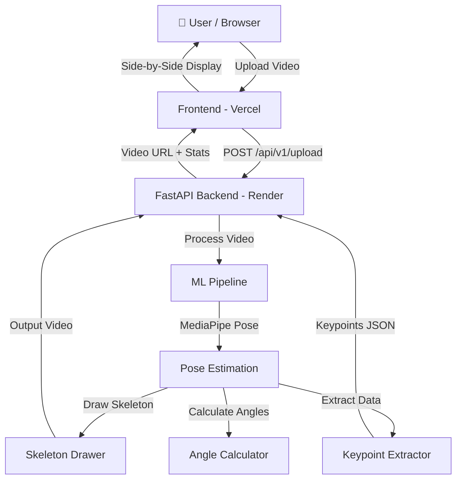

# SportIQ — Architecture

## System Architecture



## Data Flow

1. **User** selects a cricket video file on the frontend
2. **Frontend** validates file type/size, then sends via `POST` multipart form
3. **Backend (FastAPI)** receives file, saves temporarily, calls ML pipeline
4. **ML Pipeline** processes frame-by-frame:
   - MediaPipe Pose detects 33 body landmarks
   - Skeleton Drawer draws color-coded overlay
   - Keypoint Extractor saves coordinates to JSON
   - Angle Calculator computes joint angles
5. **Backend** returns processed video URL and stats JSON
6. **Frontend** displays original and processed videos side-by-side

## Component Diagram

```
┌─────────────────────────────────────────────────────────────┐
│                        FRONTEND                              │
│  ┌────────────┐  ┌────────────┐  ┌─────────────────────┐   │
│  │ index.html │  │  style.css │  │      app.js          │   │
│  │            │  │            │  │  - File validation   │   │
│  │  - Hero    │  │  - Dark    │  │  - Drag & drop       │   │
│  │  - Upload  │  │    theme   │  │  - API calls         │   │
│  │  - Results │  │  - Glass   │  │  - Video display     │   │
│  │  - Features│  │    morph   │  │  - Toast alerts      │   │
│  └────────────┘  └────────────┘  └─────────────────────┘   │
└─────────────────────────────────────────────────────────────┘
                            │
                     HTTPS / REST API
                            │
┌─────────────────────────────────────────────────────────────┐
│                        BACKEND                               │
│  ┌────────────┐  ┌────────────┐  ┌─────────────────────┐   │
│  │  main.py   │  │  video.py  │  │  pose_service.py     │   │
│  │            │  │  (Router)  │  │  (Service Layer)     │   │
│  │  - CORS    │  │            │  │                      │   │
│  │  - Startup │  │  - Upload  │  │  - Process video     │   │
│  │  - Health  │  │  - Serve   │  │  - File cleanup      │   │
│  └────────────┘  └────────────┘  └──────────┬──────────┘   │
└──────────────────────────────────────────────┼──────────────┘
                                               │
┌──────────────────────────────────────────────┼──────────────┐
│                     ML MODULE                │               │
│  ┌──────────────────┐  ┌─────────────────────▼───────────┐  │
│  │ pose_estimator.py│  │ skeleton_drawer.py               │  │
│  │ (Orchestrator)   │──│  - Green: upper body             │  │
│  │                  │  │  - Cyan: torso                   │  │
│  │  - MediaPipe     │  │  - Orange: lower body            │  │
│  │  - Frame loop    │  └─────────────────────────────────┘  │
│  │  - Output video  │  ┌─────────────────────────────────┐  │
│  │                  │──│ keypoint_extractor.py            │  │
│  │                  │  │  - 33 landmarks per frame        │  │
│  │                  │  │  - JSON serialization            │  │
│  │                  │  └─────────────────────────────────┘  │
│  │                  │  ┌─────────────────────────────────┐  │
│  │                  │──│ angle_calculator.py              │  │
│  │                  │  │  - Elbow, knee angles            │  │
│  │                  │  │  - Shoulder, hip rotation        │  │
│  └──────────────────┘  └─────────────────────────────────┘  │
└─────────────────────────────────────────────────────────────┘
```

## Deployment Architecture

```
                     Internet
                        │
          ┌─────────────┼─────────────┐
          ▼                           ▼
  ┌───────────────┐          ┌───────────────┐
  │   Vercel      │          │   Render      │
  │   (Frontend)  │──REST──► │   (Backend)   │
  │               │          │   Python 3.9  │
  │  Static Files │          │   FastAPI     │
  │  CDN Global   │          │   MediaPipe   │
  └───────────────┘          └───────────────┘
```
